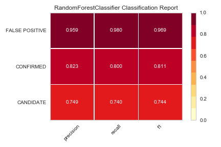
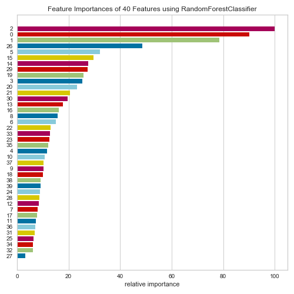

# Machine Learning - Exoplanet Exploration

## Background

Over a period of nine years in deep space, the NASA Kepler space telescope has been out on a planet-hunting mission to discover hidden planets outside of our solar system.

To help process this data, you will create machine learning models capable of classifying candidate exoplanets from the raw dataset.

- - -

## Project Outline

### Preprocess the Data

* Preprocess the dataset prior to fitting the model.
* Perform feature selection and remove unnecessary features.
* Use `MinMaxScaler` to scale the numerical data.
* Separate the data into training and testing data.

### Tune Model Parameters

* Use `GridSearch` to tune model parameters.
* Tune and compare at least two different classifiers.

### Reporting

* Create a README that reports a comparison of each model's performance as well as a summary about your findings and any assumptions you can make based on your model (is your model good enough to predict new exoplanets? Why or why not? What would make your model be better at predicting new exoplanets?).

- - -

## Resources

* [Exoplanet Data Source](https://www.kaggle.com/nasa/kepler-exoplanet-search-results)

* [Scikit-Learn Tutorial Part 1](https://www.youtube.com/watch?v=4PXAztQtoTg)

* [Scikit-Learn Tutorial Part 2](https://www.youtube.com/watch?v=gK43gtGh49o&t=5858s)

* [Grid Search](https://scikit-learn.org/stable/modules/grid_search.html)

- - -

## Report and Final Model Outcome:

### SVM (Support Vector Machine)

* The first model run on the data was an SVM (support-vector machines), which was fairly accurate in detrmining the outcome. However, it is important to train and test multiple models to insure reliability and accuracy.  The next model the data was fit to was Random forest.

  |               | BeforeCV      | AfterCV       |
  |:-------------:|:-------------:|:-------------:|
  |Training Score | 0.846         | 0.887         |
  |Testing Score  | 0.842         | 0.879         |
  
### Random Forest

*Random Forest was fairly accurate, even before hyperparameter tuning. Random forests are much simpler to train for a practitioner; it’s easier to find a good, robust model. The complexity of a random forest grows with the number of trees in the forest, and the number of training samples we have. In SVMs, we typically need to do a fair amount of parameter tuning, and in addition to that, the computational cost grows linearly with the number of classes as well.

  |               | BeforeCV      | AfterCV       |
  |:-------------:|:-------------:|:-------------:|
  |Training Score | 0.995         | 1.0           |
  |Testing Score  | 0.883         | 0.899         |

  
